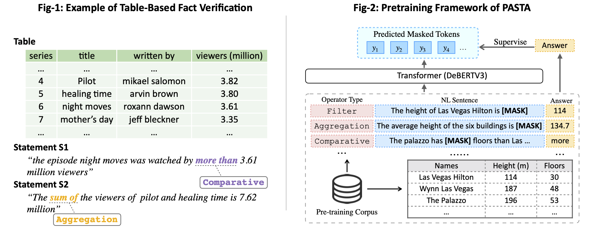

## Introduction
[](https://paperswithcode.com/sota/table-based-fact-verification-on-tabfact?p=pasta-table-operations-aware-fact)

This repository contains source code for the EMNLP'2022 paper "Table-Operations Aware Fact Verification via Sentence-Table Cloze Pre-training". In this paper we introduce **PASTA**, a novel state-of-the-art framework for table-based fact verification via pre-training with synthesized sentence–table cloze questions. In particular, we design six types of common sentence–table cloze tasks, including Filter, Aggregation, Superlative, Comparative, Ordinal, and Unique, based on which we synthesize a large corpus consisting of 1.2 million sentence–table pairs from WikiTables.



## Code Structure


```sh
|-- data_cache # save the propossed data cache for tabfact/semtabfacts
|-- datasets # save the official datasets of tabfact/semtabfacts
|-- experimental_results # save the evaluation results (acc|f1_micro) of tabfact/semtabfacts
|-- pretrained_models # the model used to adapted to the downstream tasks
|-- save_checkpoints # save the fine-tuned checkpoints of tabfact/semtabfacts
|-- src # code for fine-tune/pre-train
    |-- scripts # configs for fine-tune/pre-train
        |-- train_semtabfacts.json # you need to modify the path
        |-- train_tabfact.json # you need to modify the path
        |-- pretrain.json # you need to modify the path
    |-- utils
        |-- args.py # Definition of different parameters
        |-- dataset.py # the class to load and preprocess the dataset
        |-- linearize.py # the class to flatten a table into a linearized form, it is adapted from https://github.com/microsoft/Table-Pretraining/blob/0b87efa253232d4aafa52c1f4725cb4f6e027877/tapex/processor/table_linearize.py.
        |-- entitylink.py # the class to identify entity links between the sentence and the table, it is adapted from https://github.com/wenhuchen/Table-Fact-Checking/blob/5ea13b8f6faf11557eec728c5f132534e7a22bf7/code/preprocess_data.py.
        |-- pasta_mlm_model.py # the class to define the operation-aware pretraing model
        |-- TabFV_model.py # the class to define the table-based fact verification model
    |-- run_finetune.py # the class to train the table-based fact verification model
    |-- run_pretrain.py # the class to pre-train the pasta model from scratch
```

## Requirements
Before running the code, please make sure your Python version is above **3.8**. Then install the necessary packages by:
```sh
pip install -r requirements.txt
```

## Datasets Preparation

### TabFact
Please download the TabFact dataset from [the official GitHub repository](https://github.com/wenhuchen/Table-Fact-Checking) and put it under the folder `PASTA/datasets`.
```sh
git clone git@github.com:wenhuchen/Table-Fact-Checking.git
mv Table-Fact-Checking tabfact
mv tabfact PASTA/datasets
```

### SEM-TAB-FACTS
Please download the sem-tab-facts dataset from the official website: 
- [Manually annotated training set](https://drive.google.com/file/d/1yObzEEZJ8qM7ZjrMcbtKZ-jofpL820ft/view)
- [Dev set](https://drive.google.com/file/d/1l5iojO8q_CB-sDCjlUpa7wVi8XUrqlss/view)
- [Test set](https://drive.google.com/file/d/1Trfq0Zd2tcAV4JIR9puopmy6NC1lMj5S/view)

Then refer to this [repository](https://github.com/devanshg27/sem-tab-fact) for standardizing the table header, or you can directly download the [dataset](https://drive.google.com/file/d/1iQ9y3UetDq0-Ib70us2Oo-pwx63U2rls/view) we have processed.

Finally, put the processed dataset under the folder `PASTA/datasets`, and name it `semtabfacts`.

## Quick Start

### Download PASTA

Download the [PASTA model](https://drive.google.com/drive/folders/1sqZt8Wu7PQ3ha4260E7Gcq4WipKj6LD8?usp=sharing) and put it under folder `pretrained_models/`.

### Run TabFact
Fine-tune on the Tabfact dataset with the following command. 
```sh
python src/run_finetune.py src/scripts/train_tabfact.json
```
Note that you need to modify the paths in the `.json` file to your own paths.

### Run SEM-TAB-FACTS
Following [LKA](https://aclanthology.org/2022.coling-1.120.pdf), we also use the trained model on the TabFact to initialize the training of SEM-TAB-FACTS. Therefore, You need to train on the TabFact dataset to get the checkpoint, or you can directly download the [checkpoint](https://drive.google.com/file/d/1cUq1G9Mx_gNwmNsptBEnRaVor8c70sE2/view?usp=sharing) we provide and put it under `/save_checkpoints`.
Then, fine-tune on the SEM-TAB-FACTS dataset with the following command.
```sh
python src/run_finetune.py src/scripts/train_semtabfacts.json
```
Note that you need to modify the paths in the `.json` file to your own paths.

## Pre-training From Scratch

### Pre-training Corpus
Download the [pre-training corpus](https://drive.google.com/file/d/1ZgdPgomanqlFrka7cdfkOchE7Hxa5XzG/view?usp=sharing), which consists mostly of 128K sentence-table cloze samples. Here is an example.

**Input**: Openration-aware Masked Sentence + Linearized Table
```sh
# Mask all of the the tokens corresponding to a span at once.
[MASK] [MASK] [MASK] has the highest attendance of all date [Header] date | visitor | score | home | leading scorer | attendance | record [Row] 1 april 2008 | knicks | 115 - 119 | bucks | quentin richardson (22) | 13579 | 20 - 54 [Row] ……
```
**Output**: Answer
```sh
8 april 2008
```
Put the unzip dataset under the folder `PASTA/datasets`, and name it `pasta`.

### Run Pre-training

Pretrain the PASTA model with the following command.
```sh
python src/run_pretrain.py src/scripts/pretrain.json
```
Note that you need to modify the paths in the `.json` file to your own paths.

## Reference
```sh
@article{DBLP:journals/corr/abs-2211-02816,
  author    = {Zihui Gu and
               Ju Fan and
               Nan Tang and
               Preslav Nakov and
               Xiaoman Zhao and
               Xiaoyong Du},
  title     = {{PASTA:} Table-Operations Aware Fact Verification via Sentence-Table
               Cloze Pre-training},
  journal   = {CoRR},
  volume    = {abs/2211.02816},
  year      = {2022},
  url       = {https://doi.org/10.48550/arXiv.2211.02816},
  doi       = {10.48550/arXiv.2211.02816},
  eprinttype = {arXiv},
  eprint    = {2211.02816},
  timestamp = {Wed, 09 Nov 2022 17:33:26 +0100},
  biburl    = {https://dblp.org/rec/journals/corr/abs-2211-02816.bib},
  bibsource = {dblp computer science bibliography, https://dblp.org}
}
```
